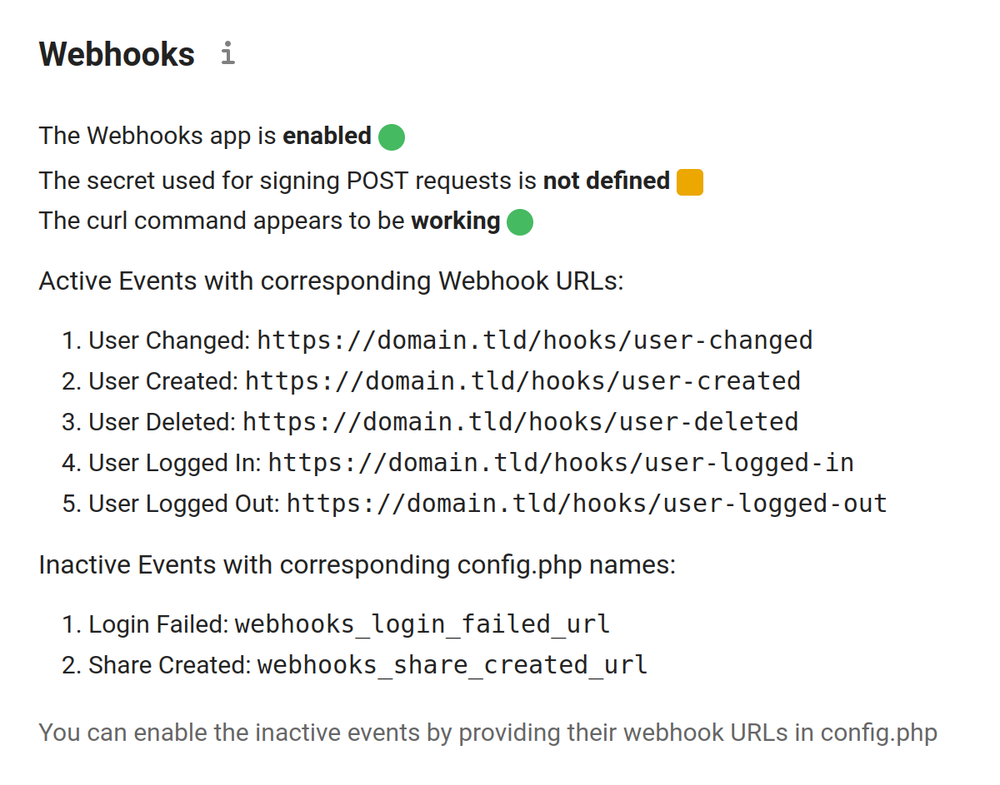

#  Webhooks for Nextcloud 

This app allows a Nextcloud instance to notify external systems via HTTP POST requests whenever an event of a given type occurs.

Features:
- Sending webhook notifications to URLs specified on per-event type basis (7 event types supported as of the current version)
- Authenticating outgoing POST requests with SHA256 signatures
- Outgoing requests are sent in a fire-and-forget (`exec(curl &)`) manner in order not to block the thread execution

## Requirements

-   Nextcloud version 20-22
-   Ability to `exec(curl)` from a PHP script

## Usage

This app is not published in the Nextcloud App Store yet. You can install it manually by putting the contents of this repository in the `/apps/webhooks` folder of your Nextcloud instance and activating it in the Admin UI.

When active, the App status is reported in Settings > Administration > Webhooks.



In order to enable webhooks for a given event type, you have to provide the target URL with the config key corresponding the a given event in your [config file](https://docs.nextcloud.com/server/latest/admin_manual/configuration_server/config_sample_php_parameters.html). Example (User Logged In Event):

```PHP
  'webhooks_user_logged_in_url' => 'https://your-service.tld/hooks/user-logged-in',
```

## Authenticating requests

If the Nextcloud instance and the service responsible for receiving incoming webhook notifications are to communicate over public internet, it is important to provide a secret key used for signing the notifications in order to protect the receiving service from spoofing attacks. This app allows you to define `webhooks_secret` in your Nextcloud `config.php` like so:

```PHP
  'webhooks_secret' => 'yoursecret1234',
```

Once the secret is defined, all outgoing webhook notifications will contain a signature in the `X-Nextcloud-Webhooks` HTTP header. The signature is calculated by performing a SHA256 function on the POST request raw body concatenated with the secret defined earlier.

Below is a minimal example of a Node.js Express app (with `body-parser`) validating incoming webhook notification signature:

```javascript
const express = require("express");
const app = express();
const bodyParser = require('body-parser');
const crypto = require('crypto');

app.use(bodyParser.json({
  verify: function(req, res, buf, encoding) {
        req.rawBody = buf.toString();
    }
}))

app.post('/login-failed', (req, res) => {
  var hash = crypto.createHash('sha256');
  hash.update(req.rawBody + "yoursecret1234");
  var expected = hash.digest('hex');
  var obtained = req.get('X-Nextcloud-Webhooks');

  console.log("expected: ", expected);
  console.log("obtained: ", obtained);

  if (expected === obtained) {
    // request signature is VALID
    console.log(req.body);
  } else {
    // request signature is INVALID
  }

  res.status(200);
})

app.listen(3000, () => { console.log("Server started.") })

```

## Available events

### Login Failed

Fires whenever a login attempt with an existing username fails.

Config name: `webhooks_login_failed_url`

Notification payload:
```javascript
{
  userId: 'admin',
  eventType: 'OCP\\Authentication\\Events\\LoginFailedEvent'
}
```

### Share Created

Fires whenever a new share is created.

Config name: `webhooks_share_created_url`

Notification payload:
```javascript
{
  id: '1',
  fullId: 'ocinternal:1',
  nodeId: 7,
  nodeType: 'file',
  shareType: 3,
  sharedWith: null,
  sharedWithDisplayName: null,
  sharedWithAvatar: null,
  permissions: 17,
  status: 0,
  note: '',
  expirationDate: null,
  label: '',
  sharedBy: 'admin',
  shareOwner: 'admin',
  token: '7qSPknbEjeHAzgJ',
  target: '/welcome.txt',
  shareTime: {
    date: '2021-06-20 14:23:18.000000',
    timeinzone_type: 3,
    timezone: 'UTC'
  },
  mailSend: true,
  hideDownload: false,
  eventType: 'OCP\\Share\\Events\\ShareCreatedEvent'
}
```

### User Changed

Fires whenever a user account is edited. Includes values before and after edit.

Config name: `webhooks_user_changed_url`

Notification payload:
```javascript
{
  user: {
    id: 'jdoe',
    displayName: 'John Doe',
    lastLogin: 0,
    home: '/home/nextcloud/data/jdoe',
    emailAddress: 'jdoe@example.com',
    cloudId: 'jdoe@yourcloud.tld',
    quota: '5 GB'
  },
  feature: 'quota',
  value: '5 GB',
  oldValue: 'default',
  eventType: 'OCP\\User\\Events\\UserChangedEvent'
}

```

### User Created

Fires whenever a new user is created.

Config name: `webhooks_user_created_url`

Notification payload:
```javascript
{
  user: {
    id: 'admin',
    displayName: 'Jane Doe',
    lastLogin: 1624203500,
    home: '/home/nextcloud/data/admin',
    emailAddress: null,
    cloudId: 'admin@yourcloud.tld',
    quota: 'none'
  },
  loginName: 'admin',
  isTokenLogin: false,
  eventType: 'OCP\\User\\Events\\UserLoggedInEvent'
}
```

### User Deleted

Fires whenever a user account is deleted.

Config name: `webhooks_user_deleted_url`

Notification payload:
```javascript
{
  user: {
    id: 'jdoe',
    displayName: 'John Doe',
    lastLogin: 0,
    home: '/home/nextcloud/data/jdoe',
    emailAddress: null,
    cloudId: 'jdoe@yourcloud.tld',
    quota: 'none'
  },
  eventType: 'OCP\\User\\Events\\UserDeletedEvent'
}
```

### User Logged In

Fires whenever a user logs in successfully.

Config name: `webhooks_user_logged_in_url`

Notification payload:
```javascript
{
  user: {
    id: 'admin',
    displayName: 'Jane Doe',
    lastLogin: 1624203500,
    home: '/home/nextcloud/data/admin',
    emailAddress: null,
    cloudId: 'admin@yourcloud.tld',
    quota: 'none'
  },
  loginName: 'admin',
  isTokenLogin: false,
  eventType: 'OCP\\User\\Events\\UserLoggedInEvent'
}
```

### User Logged Out

Fires whenever a user logs out successfully.

Config name: `webhooks_user_logged_out_url`

Notification payload:
```javascript
{
  user: {
    id: 'admin',
    displayName: 'Jane Doe',
    lastLogin: '1624203500',
    home: '/home/nextcloud/data/admin',
    emailAddress: null,
    cloudId: 'admin@yourcloud.tld',
    quota: 'none'
  },
  eventType: 'OCP\\User\\Events\\UserLoggedOutEvent'
}
```
